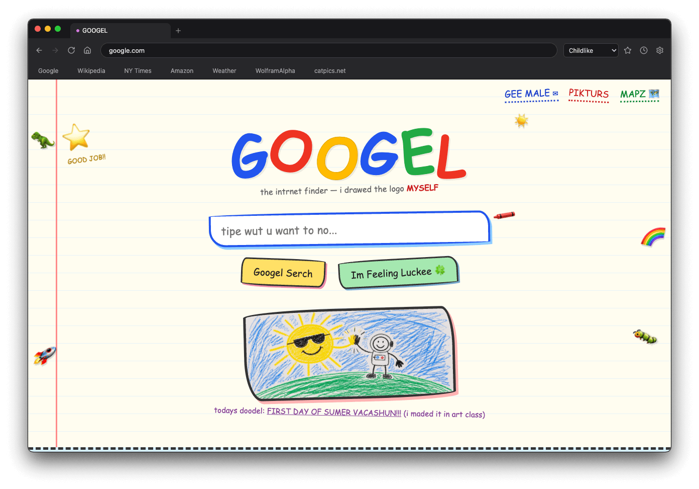
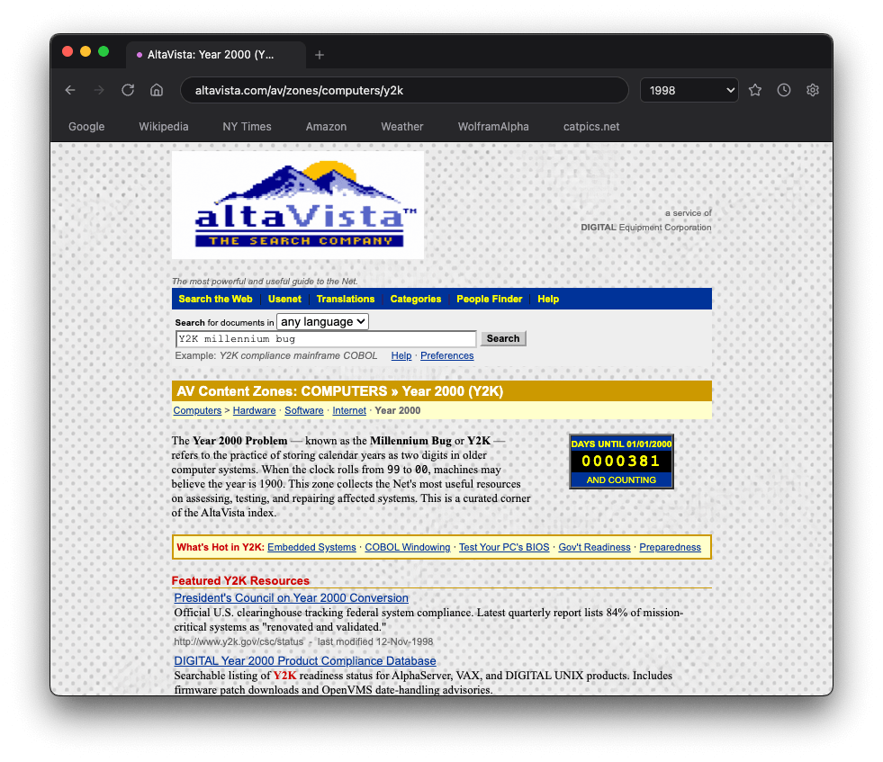

# Sl<sub></sub>pera

*The browser for the slop era.*

Slopera is a desktop browser that never touches the real web. Type any URL (real or invented) and the page is **hallucinated on the fly** by an LLM.


https://github.com/user-attachments/assets/8501b84e-ae59-4b13-8395-702df8cbcccb


*The Google and Reddit above are not real. Every page, all its text and images, is made up on the spot.*

### Also works with interactive web apps


https://github.com/user-attachments/assets/2e068f61-1eff-45ae-be8f-5aa8fb2bf662


*The HTML game above was dreamed up by AI.*

## Lenses

A **lens** is the register the whole web gets dreamed in. Pick one from the
toolbar dropdown:

- **Straight**: earnest renditions of real sites, filled with plausible
  content that never existed.
- **Extra slop**: maximum algorithm-poisoned internet: impossible products,
  listicles that lose count, too many call-to-action buttons.
- **1998**: every site as its Geocities-era self: table layouts, hit
  counters, "best viewed in Netscape Navigator 4".
- **Childlike**: pages as drawn by a 6-year-old with crayons.




You can also create your own lens in **Settings**: give it a name and a short
flavor prompt, and it appears in the dropdown alongside the built-ins. Each
lens keeps its own cache of dreamed pages, so switching lenses lets you
revisit the same URL in a different reality.

## Running it

Grab an installer for macOS, Windows or Linux from the
[Releases page](https://github.com/fresswolf/Slopera/releases), or run from
source:

```sh
npm install
npm run dev
```

Either way, open Settings (gear icon) and paste:

- an **API key** from **Anthropic** or **OpenRouter**. Required, dreams the pages
- a **fal.ai key**. Optional, generates images. With an OpenRouter key you can instead pick from alternative (but slower) image models served via OpenRouter. Without either, images degrade into captioned placeholders.

Keys are stored encrypted via the OS keychain (`safeStorage`) and only ever
sent to their respective APIs. Browsing already-dreamed pages costs nothing.

> **Use at your own risk.** Every freshly dreamed page and image is a paid API
> call billed to your keys, and generated content is unmoderated LLM output.

### Getting API keys

- **OpenRouter**: go to <https://openrouter.ai/> and click "Sign Up", add credits at
  <https://openrouter.ai/settings/credits>, then create a new API key at
  <https://openrouter.ai/workspaces/default/keys>.
- **fal.ai**: go to <https://fal.ai/> and click "Get Started" to create an account, top up at
  <https://fal.ai/dashboard/usage-billing/credits>, then create an API key at
  <https://fal.ai/dashboard/keys>.
- **Claude (Anthropic)**: create an account at <https://platform.claude.com/>, add funds through
  <https://platform.claude.com/dashboard>, then create a key at
  <https://platform.claude.com/settings/workspaces/default/keys>.

### Fidelity vs. speed vs. cost

Every page is a fresh LLM generation, so depending on your model settings
Slopera can burn through tokens quickly. Pick your trade-off in Settings:

- **Fast & cheap**: **Claude Haiku** is currently the fastest text model at a
  reasonable token cost, and **FLUX schnell** (only available via fal.ai) is
  super fast and cheap for images. A good default for casual browsing.
- **High fidelity**: for rich, interactive pages (working web apps, games)
  you may need bigger models like **Claude Opus**, paired with a higher-end
  image model such as **GPT Image 2**. Noticeably slower and pricier per page. **GLM 5.2** has been shown to give high fidelity at a comparably low cost, but it's slow.

## Development

```sh
npm run typecheck     # strict TS, main + renderer
npm run lint          # eslint
npm test              # vitest: omnibox parsing, fence-stripping, prompts, extraction
npm run build         # electron-vite production build
npm run test:e2e      # playwright: boots the built app (run `npm run build` first)
npm run package:mac   # .dmg into release/
npm run package:win   # NSIS installer (x64) into release/
npm run package:linux # AppImage (x64) into release/
npm run icons         # regenerate app icons from logo.png
```

`SLOPERA_FAKE_GEN=1 npm run dev` runs the whole browser against a canned
offline generator — useful for UI work and used by the e2e test. CI
(GitHub Actions, `.github/workflows/release.yml`) runs lint, typecheck and
unit tests on every push, and builds installers for macOS, Windows and Linux;
pushing a `v*` tag collects them into a draft GitHub Release.

## Repo layout

```
src/main/        tabs, protocol handlers, generation, stores
src/preload/     typed IPC bridge
src/renderer/    browser chrome (React)
src/shared/      pure logic: URL handling, fence-stripping, lenses, types
tests/           vitest unit tests + playwright smoke test
SPEC.md          full feature spec & architecture decisions
```

## License

MIT. Nothing Slopera renders is real; any resemblance to actual websites,
living or dead, is the point.
